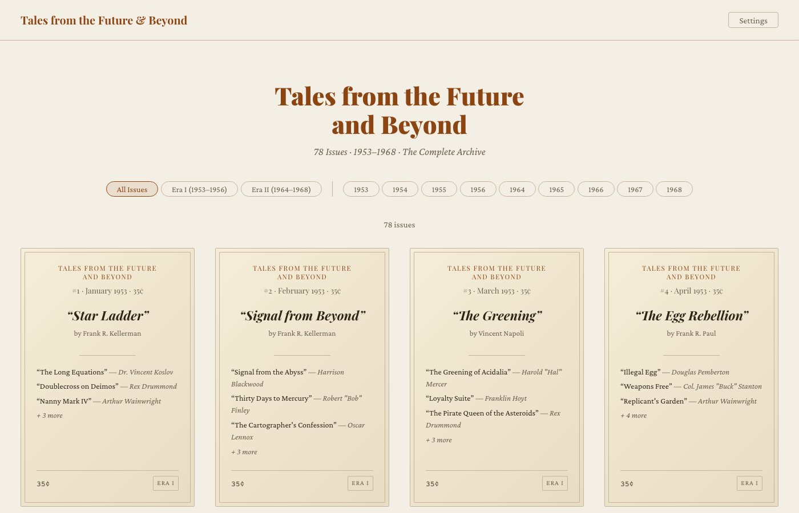

# Tales from the Future and Beyond

A digital reading archive for the classic sci-fi pulp magazine "Tales from the Future and Beyond" (1953–1968).

## Screenshots

### Shelf View

### Reader View

## Overview

This web-based reader provides access to all 78 issues across two publication eras:

- **Era I (1953–1956):** 48 issues from the original run
- **Era II (1964–1968):** 30 issues from the revival period

## Features

- **Shelf View** — Browse all issues in a visual grid with filtering by era and year
- **Reader View** — Distraction-free reading experience with:
  - Table of contents navigation
  - Reading progress indicator
  - Customizable font size and line height
- **Themes** — Sepia, Light, and Dark modes
- **Responsive Design** — Works on desktop and mobile devices

## Tech Stack

- Vanilla HTML, CSS, JavaScript
- No build tools or dependencies required
- Static site ready for any web host

## Live Demo

Visit the live site: [https://daniel-henslowe.github.io/tales-reader](https://daniel-henslowe.github.io/tales-reader)

## License

Public domain content. Reader interface open source.
